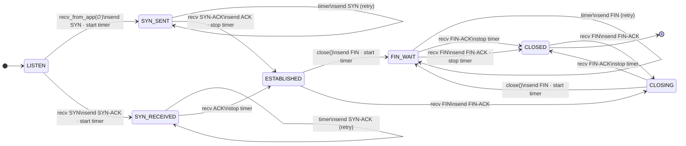
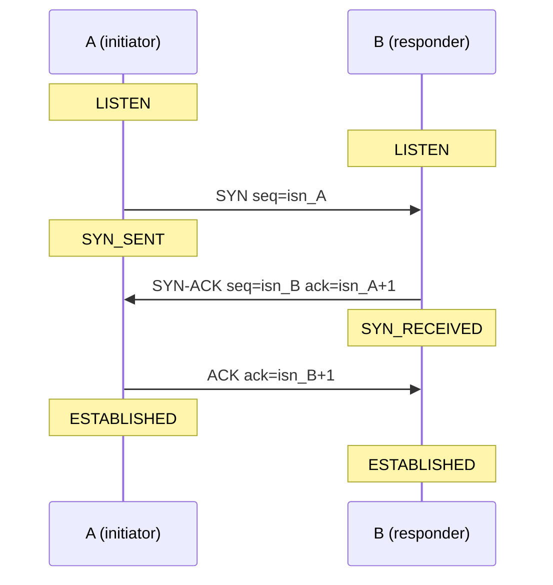
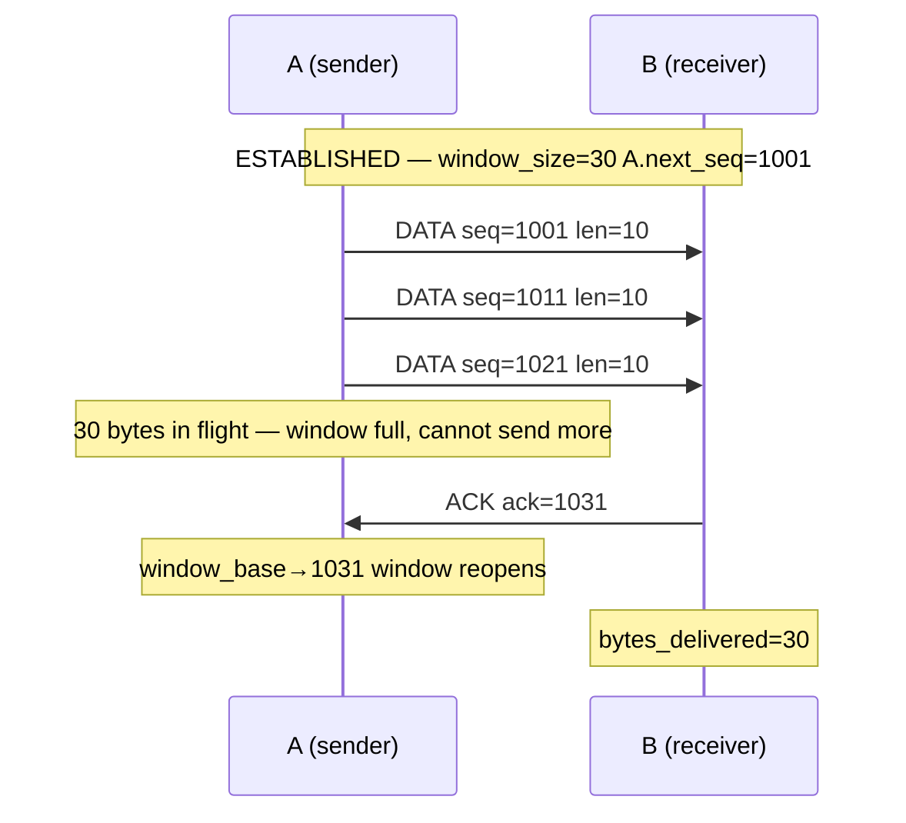
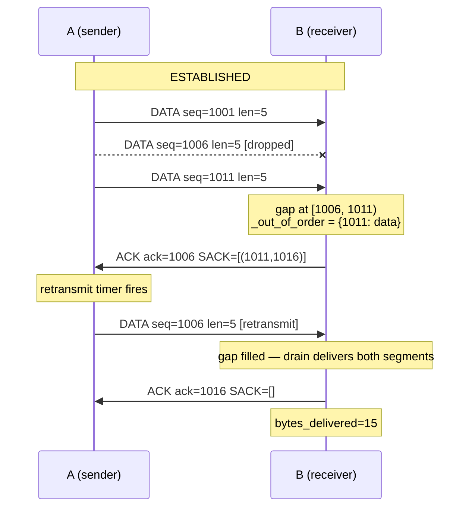
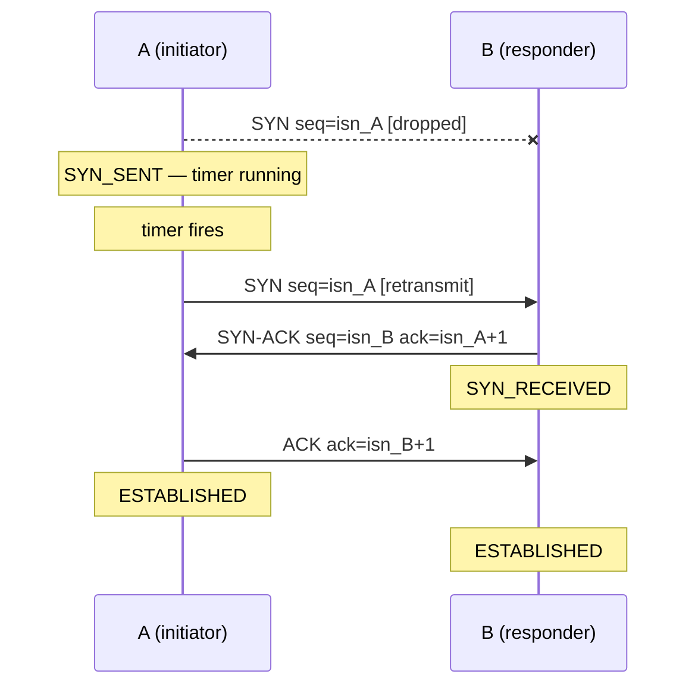
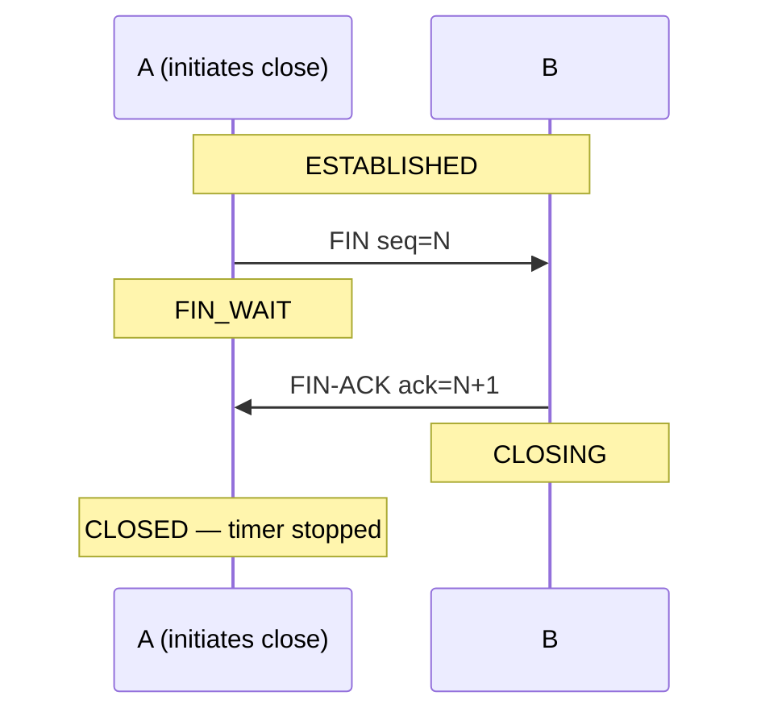
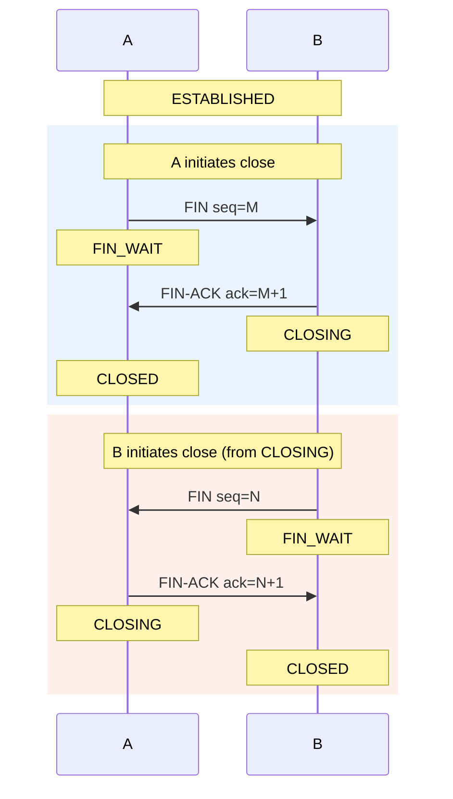

# RDP Protocol Diagrams

GitHub and VS Code both render Mermaid diagrams inline. If you are reading
a plain text copy, every code block tagged `mermaid` is a diagram.

---

## Connection State Machine

Each `TCPConnection` starts in **LISTEN** and ends in **CLOSED**.
The diagram shows every state transition.

Notation: `recv X` = packet X arrived from network; `send X` = packet X
transmitted; `timer` = retransmit timer fired. Events that keep the connection
in **ESTABLISHED** (receiving DATA, receiving ACK, timer retransmit) are
described in the note below rather than shown as self-arrows.

**ESTABLISHED in-state events** (no state change):

| Event | Action |
|-------|--------|
| `recv DATA` (in-order) | Append to receive buffer; advance `_peer_ack_num`; drain out-of-order buffer; send ACK |
| `recv DATA` (out-of-order) | Store in `_out_of_order`; rebuild SACK blocks; send ACK with SACK |
| `recv DATA` (duplicate) | Send ACK with current cumulative ack number |
| `recv ACK` | Advance `_window_base`; prune `_unacked` with SACK blocks; try to send more from queue |
| `timer` | Retransmit oldest unacked segment; increment retransmit count |

---

## Three-Way Handshake

Both sides start in LISTEN. The initiator triggers the handshake by calling
`recv_from_app(b"")`.

After the handshake: `_next_seq = isn + 1` and `_window_base = isn + 1` on
both sides. The SYN occupies one sequence number.

---

## In-Order Data Transfer

The sender keeps sending as long as bytes-in-flight < `window_size`.
When the window fills, it stalls until an ACK advances `_window_base`.

---

## Out-of-Order Delivery and SACK

When a segment arrives out of order, the receiver stores it in `_out_of_order`,
reports its range in a SACK block, and replies with the cumulative ACK up to
the gap. The sender retransmits the missing segment. Once the gap is filled,
`_drain_out_of_order` delivers the buffered data in order.

Up to three non-overlapping SACK blocks can appear in a single ACK. The sender
uses them to skip already-received segments when deciding what to retransmit.

---

## Handshake Loss and Retransmit

The retransmit timer fires if a SYN or SYN-ACK is not acknowledged within
`timer_interval`. Both sides retry up to `MAX_HANDSHAKE_RETRIES` times.

---

## Unilateral Teardown

The initiating side reaches CLOSED immediately when its FIN-ACK arrives.
The responding side reaches CLOSING and remains there until its own `close()`
is called (or until the session ends).

---

## Bidirectional Teardown

Both sides eventually call `close()`. The second close is issued from CLOSING,
which sends a FIN and re-enters the FIN_WAIT / CLOSED cycle.

When A receives B's FIN while in CLOSED, it sends a FIN-ACK and transitions
to CLOSING. B receives that FIN-ACK and transitions to CLOSED.
