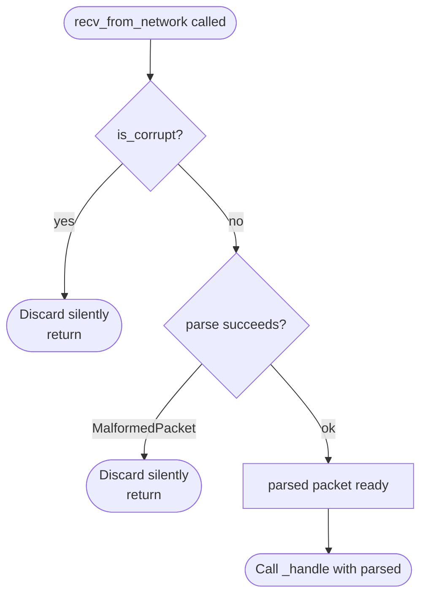
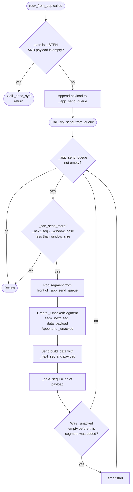
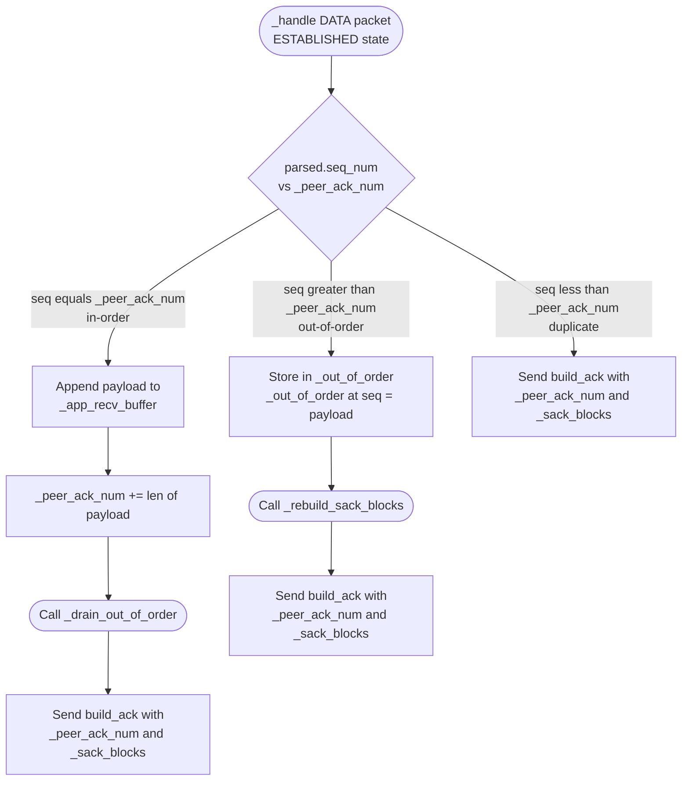
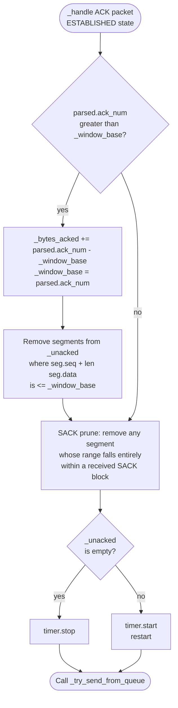
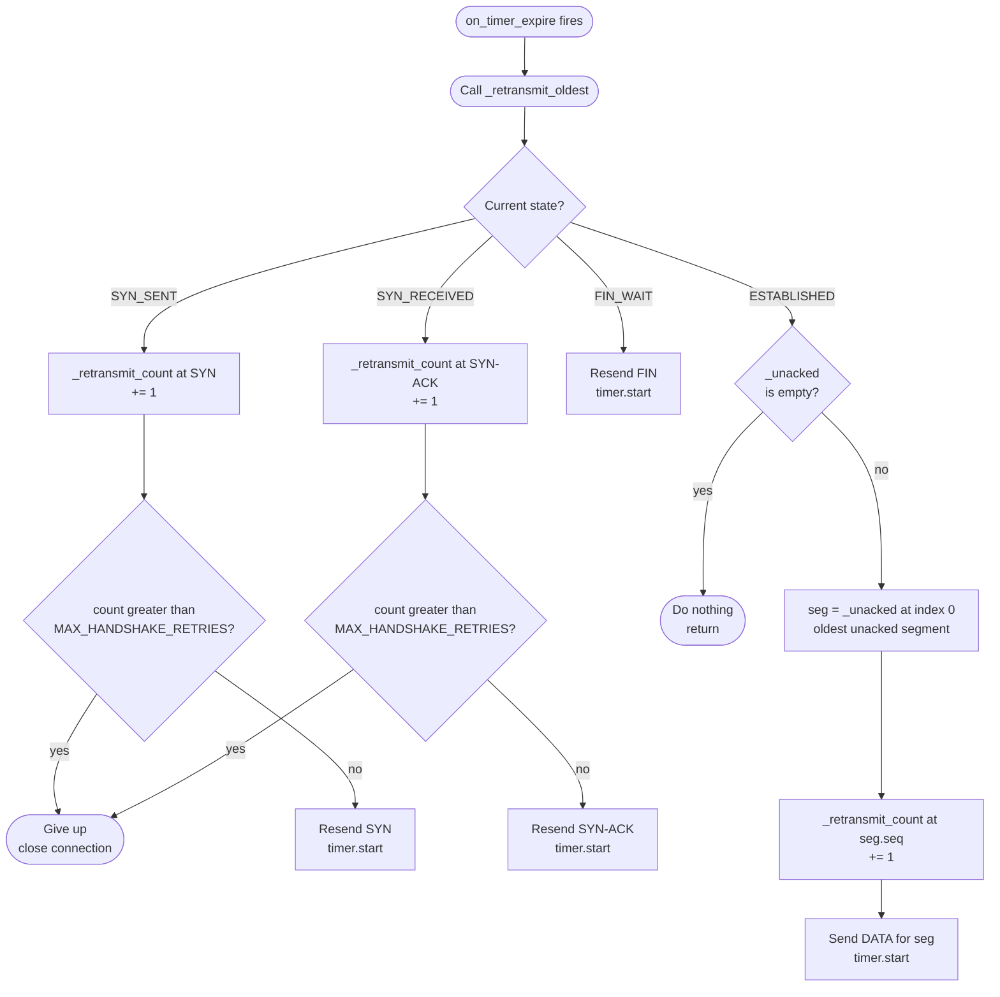
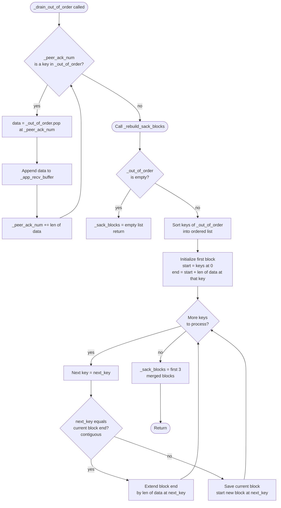

# RDP Implementation Reference

This document describes the **internal code behavior** of the `TCPConnection` class — what data structures change, what decisions are made, and in what order. It is a companion to `fsm.md`, which covers the state-machine transitions and packet exchange between hosts.

Each section below shows one logical path through the code. The variable names used in node labels match the Python attributes directly so you can cross-reference with the source.

---

## 1. Incoming Packet Processing

Every packet that arrives from the network enters through `recv_from_network`. Before any protocol logic runs, the packet is checked for corruption and then parsed. Only a well-formed packet is dispatched to `_handle`.

---

## 2. Send Path

Application data enters through `recv_from_app`. The special case of an empty payload on a LISTEN-state socket triggers the handshake. All other payloads are queued and then flushed by `_try_send_from_queue`, which respects the congestion window before transmitting each segment.

---

## 3. Receiving Data

When an established connection receives a DATA packet, `_handle` compares the packet's sequence number against `_peer_ack_num` — the next in-order byte the receiver expects. There are exactly three outcomes: the segment fills the gap perfectly (in-order), it arrives ahead of the gap (out-of-order), or it duplicates something already delivered (duplicate). Each path sends an ACK, but only the in-order path advances `_peer_ack_num` and delivers to the application.

---

## 4. ACK Processing

When a DATA packet's ACK is received, `_handle` performs up to four actions in order: advance the window if new bytes are acknowledged, prune `_unacked` using any SACK blocks in the ACK, decide whether to stop or restart the retransmit timer, and then attempt to send more queued data. Window advancement and SACK pruning are independent — SACK pruning always happens even if the cumulative ACK did not move.

---

## 5. Retransmit Logic

The retransmit timer fires `on_timer_expire`, which delegates immediately to `_retransmit_oldest`. The action taken depends on the current connection state. Handshake states (SYN_SENT, SYN_RECEIVED) track per-phase retry counts and give up after `MAX_HANDSHAKE_RETRIES`. In ESTABLISHED state, only the oldest unacked segment (index 0 of `_unacked`) is retransmitted.

---

## 6. Out-of-Order Buffer Management

`_drain_out_of_order` is called whenever `_peer_ack_num` advances. It repeatedly checks whether the newly expected sequence number is already buffered in `_out_of_order`, and if so delivers it to the application and advances `_peer_ack_num` again. After the drain loop completes, `_rebuild_sack_blocks` re-computes the SACK ranges from whatever remains in `_out_of_order`.

